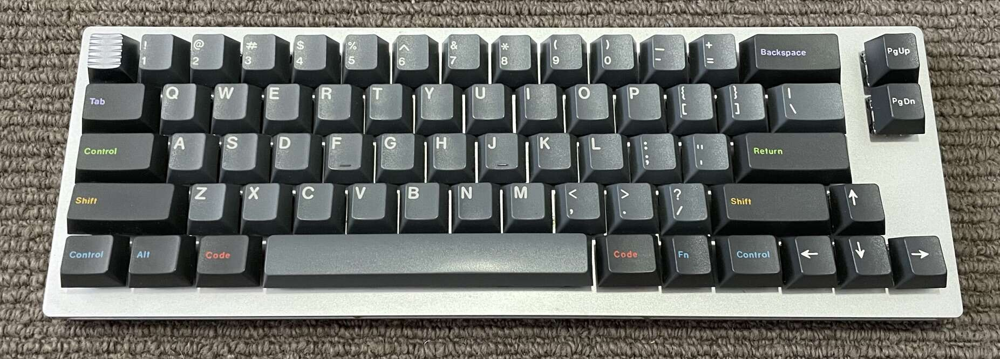

Rust Firmware for Clueboard 66% Low Profile Keyboard
====================================================

A firmware for the [Clueboard 66% Low Profile keyboard][clueboard] (also known
as 66% hotswap) implemented in pure Rust using [Keyberon].

The Clueboard 66% LP uses a STM32F303 ARM Cortex-M4 microcontroller. It also
has an IS31FL3731 for controlling white LEDs on each switch, and two speakers.
I've not yet implemented support for the LED controller or speakers.

## Building

**Note:** These instructions have only been tested on a Linux host.

### Install the Rust compiler, ARM Cortex target, and [cargo-binutils]:

    curl --proto '=https' --tlsv1.2 -sSf https://sh.rustup.rs | sh
    rustup target add thumbv7em-none-eabihf
    rustup component add llvm-tools-preview
    cargo install cargo-binutils

### Install [dfu-util]:

    sudo pacman -S dfu-util # or equivalent for your OS

### Compile the firmware:

    cargo objcopy --release -- -O binary clueboard.bin

## Flashing

Enter DFU mode by pressing the FLASH button on the underside keyboard. Then
flash it with [dfu-util]:

    dfu-util -d 0483:df11 -a 0 --dfuse-address 0x08000000:leave -D clueboard.bin

Licence
-------

This project is dual licenced under either of:

- Apache License, Version 2.0 ([LICENSE-APACHE](https://github.com/wezm/clueboard-rust-firmware/blob/master/LICENSE-APACHE))
- MIT license ([LICENSE-MIT](https://github.com/wezm/clueboard-rust-firmware/blob/master/LICENSE-MIT))

at your option.

[Keyberon]: https://github.com/TeXitoi/keyberon
[clueboard]: https://clueboard.co/clueboard-66-low-profile
[dfu-util]: http://dfu-util.sourceforge.net/
[cargo-binutils]: https://lib.rs/crates/cargo-binutils
